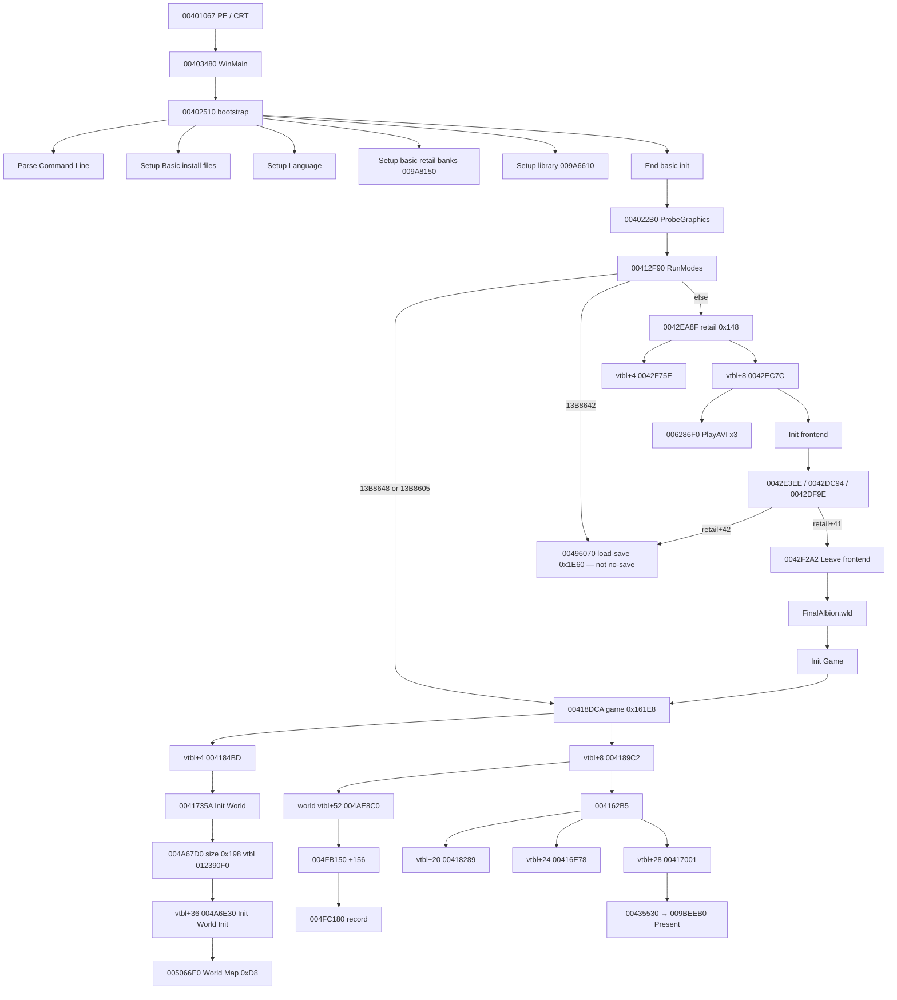

# Forward call tree — PE entry through no-save New Game

This is the **executable walk**, not a name search.

Every node is an `E8` / vtbl slot recovered with
`tools/Fable.ExeIndex` (`fn --exact`, `calls`, `vtbl`).
Do not add a function because a string looks related.
Do not start at `00DBDE40` / `StartOakVale`.

**No-save New Game path is the default retail branch:**
`[0x13B8648]=0`, `[0x13B8605]=0`, `[0x13B8642]=0`,
`[retail+41]=1` after frontend message 15.

Statuses:

| Word | Meaning |
|---|---|
| **PROVEN** | Body dumped; callee list is from that dump |
| **SLOT** | Vtbl slot proven; body may be a later dump |
| **UNREAD** | On the tree, body not yet walked |

---

## How to regenerate

From the repo root, against TLC `Fable.exe`:

```text
dotnet run --project tools/Fable.ExeIndex -- fn 00401067 --exact 80
dotnet run --project tools/Fable.ExeIndex -- fn 00403480 --exact 40
dotnet run --project tools/Fable.ExeIndex -- fn 00402510 --exact 250
dotnet run --project tools/Fable.ExeIndex -- fn 00412F90 --exact 120
dotnet run --project tools/Fable.ExeIndex -- fn 0042EC7C --exact 160
dotnet run --project tools/Fable.ExeIndex -- fn 004184BD --exact 200
dotnet run --project tools/Fable.ExeIndex -- fn 004189C2 --exact 120
dotnet run --project tools/Fable.ExeIndex -- fn 0041735A --exact 80
dotnet run --project tools/Fable.ExeIndex -- fn 004A6E30 --exact 100
dotnet run --project tools/Fable.ExeIndex -- vtbl 0122F180
dotnet run --project tools/Fable.ExeIndex -- fn 009A8150 --exact 20
dotnet run --project tools/Fable.ExeIndex -- fn 0049E620 --exact 80
dotnet run --project tools/Fable.ExeIndex -- fn 00A09F20 --exact 80
dotnet run --project tools/Fable.ExeIndex -- fn 00A27030 --exact 40
dotnet run --project tools/Fable.ExeIndex -- fn 009AD410 --exact 40
```

String dumps (`START_NEW_QUEST`, `Q_NewOakValeIntro`, …) are
**not** a parent of any node below. Those tokens live in QST/WLD
parsers reached only if this tree calls them.

---

## Overview



---

## 1. Process entry

```
00401067  PE entry / CRT  PROVEN
├── 0040138C  SEH frame
├── 004012CE  static ctors
├── 00401377  nop
├── 0040135C  heap range
├── 00401356  IAT
├── 004012BC  atexit wrapper
└── 00403480  WinMain  PROVEN
    ├── 00BFEA30  alloca 0x32008
    ├── [0x143FE24] / [0x143FE28]  mutex "Fable" (IAT)
    ├── 009D86B0  zero scratch
    ├── 00402510  bootstrap  PROVEN
    └── 00BFE9F9  alloca unwind
```

WinMain does **not** call New Game, `00DBDE40`, or any region loader.

---

## 2. Bootstrap `00402510`

Named stages are **push string then work**. Order is the file order.

```
00402510  bootstrap  PROVEN
├── "Parse Command Line"          00402521
│   ├── 00403B10
│   └── 00997510 / 009974F0
├── "Setup Basic install files"   004025B3
│   ├── 00404440
│   └── 009D5240
├── "Setup Language"              0040266F
│   ├── 00415530
│   └── 004045C0  LeftAlignText / NoHangulWordWrap / DisableCapsLock
├── "Setup basic retail banks"    00402845
│   ├── 009A76D0  bank manager [0x13CA79C]
│   └── 009A8150  register pair
│       GBANK_MAIN / GBANK_MAIN_PC
│       GBANK_GUI / GBANK_GUI_PC
│       GBANK_FRONT_END / GBANK_FRONT_END_PC
│       PARTICLE_MAIN / PARTICLE_MAIN_PC
│       PARTICLE_FRONTEND / PARTICLE_FRONTEND_PC
├── "Setup library"               00403079
│   ├── [0x137545C] / [0x1375460]  display 1024×768
│   ├── 004023F0  TEXT_GUI_WINDOW_TITLE
│   ├── 009A4EC0  engine singleton
│   └── 009A6610  Setup library (CreateDevice lives under here)
├── "End basic init"              00403354
│   ├── 00418C3B                  if [0x1375459]
│   ├── 004022B0  ProbeGraphics   if Setup library returned 1
│   ├── 0040D2A0 / 0040D400       optional video object
│   ├── 00412F90  RunModes        ecx = 0x13B83D0
│   └── 00401B80  Shutdown
└── fail path                     00401C00
```

---

## 3. RunModes `00412F90`

```
00412F90  RunModes  PROVEN
├── [0x13B8648] != 0
│   └── alloc 0x161E8 → 00418DCA → [edx+4] 004184BD
│       (skip frontend; not no-save default)
├── else [0x13B8605] != 0
│   └── same 00418DCA game object
├── else [0x13B8642] != 0
│   └── alloc 0x1E60 → 00496070 → [edx+4]
│       LOAD / continue — not no-save New Game
└── else  (no-save default)
    └── alloc 0x148 → 0042EA8F retail
        ├── store [esi+8] = retail
        └── loop while [esi+524]==0
            ├── [retail].vtbl+8  0042EC7C  pump
            ├── replace [esi+8] if pump writes a successor
            └── [0x13B7D58] dtor if set
```

Retail vtbl `01230CA0`: slot 1 start `0042F75E`, slot 2 pump `0042EC7C`.

---

## 4. Retail pump `0042EC7C` — videos, frontend, New Game

```
0042EC7C  retail pump  PROVEN
├── 009E1BC0  QPC dt → [esi+184]/[+188]
├── video table (3 slots, 32 bytes each)  if [0x1375448] && [0x137544A]
│   ├── Data\Video\lionhead_logo.xmv      640×400  RGBA 0xFFFFFFFF
│   ├── Data\Video\Microsoft_Logo.xmv     640×480  RGBA 0xFF000000
│   ├── Data\Video\intro_comp.xmv         640×360  RGBA 0x00000000
│   ├── [0x13961E0] = slot RGBA          PROVEN 0042ED85
│   └── 006286F0  PlayAVI  (dest 00628B79; Present 009BEEB0)
├── [0x13B8616]==0 skip 009A8840         PROVEN first-seen
├── [esi+9]=1
├── 0042E98F  00595582 → +180; 009BFF40 1024×768  PROVEN
├── "Init Engine"   0042E204
├── "Init frontend"
│   ├── alloc 16 → 0042DB40 vtbl 01230C34  PROVEN
│   ├── 009D8CF0 clear + 009BEEB0 Present  PROVEN (black after AVI)
│   ├── 0042DED5(0)  audio vtbl+68         PROVEN
│   ├── 005952C3
│   ├── 0062F800 / 0062F8B0
│   └── 0040F0E0
└── frame loop until 009A6460==2 or [esi+8]
    ├── 0042E3EE  input  [0x13B8388] / 009F4ED0
    ├── 0042DC94  update
    ├── 0042FA30  zero 112-byte record
    ├── 0042DBFA  fill
    ├── 0042DF9E  009D8CF0 / 009BEF20 / 00595582 / 00595222
    │              00595222 is [ui+84] walk only  PROVEN
    │              [node+20] vtbl+8 = 0041AFA0 (0122F5D4)
    │              0041B800 [+372]=2 [+376]=0 [+380]=0
    │              0041AC20 vtbl+432 00530EC0; empty → +376=0
    │                skip +204/+208  PROVEN
    │              0041AFA0 dest +248/+264 ctor 0 → 0,0,0,0  PROVEN
    │              0041BEB0 type 0x22 (not sibling 0041BF60)
    │              [edx+92] dest this+0x15C size 0xC0
    │              009D9C80 / 009DA9F0(1) empty skip DIP  PROVEN
    │              nonempty (not first-seen): 00A058C0 +
    │                [dev+88].vtbl+332 prim 2/4, VB +16008
    │              enqueue is 009DB700 (+16020), not 0041BEB0
    └── 0059A238 UI vtbl+32 (012521C8)  PROVEN
        msg 15 → 0059A2DA [ui+28].vtbl+16
        then 00594F28 [retail+41]=1
        0042EC7C reads +41 → Leave 0042F2A2
    │              00404A80 → 00404C00 [0x13B7CD8+8]==0 skip
    │              009D9C80 / 009DA9F0(1)
    │              009BEF50 / 009BEEB0
    └── exit
        ├── [esi+42] != 0   LOAD
        │   └── alloc 0x1E60 → 00496070 → [eax+4]
        └── [esi+41] != 0   NEW GAME (msg 15 / 0059A2DA / 00594F28)
            └── 0042F2A2 "Leave frontend"  PROVEN
                ├── [0x1375448]=0
                ├── [0x13B8394].vtbl+72(500)  optional
                ├── [0x13B8616]==0 skip 009A78D0/009A8840  PROVEN first-seen
                ├── 00404490
                ├── 004131A0  path record
                ├── "FinalAlbion.wld" → record
                ├── 0042EBB6  teardown  PROVEN
                │   ├── +41!=0 skip audio stop
                │   └── 009BE420 clear + 009BEEB0 Present
                ├── "Init Game"
                ├── alloc 0x161E8 → 00418DCA
                ├── [ebx].vtbl+4  004184BD
                └── [ebp+124] = game; [0x13B7D58] = old retail
```

Frontend New Game click is **message 15** (`0059A238` → `0059A2DA` →
`[retail+41]=1`). That flag is what this pump reads. It does **not**
call `00DBDE40`.

---

## 5. Game object

Ctor `00418DCA` — size `0x161E8`, vtbl `0122F180`, `[+90593]=1`.

### Vtbl `0122F180` (first 10 slots)

| Slot | Off | VA | Role |
|---:|---:|---|---|
| 0 | +0 | `004197B3` | dtor path |
| 1 | +4 | `004184BD` | start — Init Game stages |
| 2 | +8 | `004189C2` | pump |
| 3 | +12 | `0041799B` | UNREAD |
| 4 | +16 | `004197A0` | UNREAD |
| 5 | +20 | `00418289` | update |
| 6 | +24 | `00416E78` | player input after WorldFrame>1 |
| 7 | +28 | `00417001` | render |
| 8 | +32 | `00416953` | Loading world / Loading save |
| 9 | +36 | `004197B0` | UNREAD |

Slots 10+ overlap a string (`HERO_ABILITY`) — not a vtbl continuation.

---

## 6. Game start `004184BD` (vtbl+4)

```
004184BD  Init Game  PROVEN
├── [0x13B86A0] = game
├── 009E9EF0 / 009E9F90
├── 00416832
├── 00414C90 / 009ED190
├── 0044C6B6  else alloc 0xE0 → 0044C6C2 / 0044C71F
├── "Init Thing Components"           004EE23F
├── "Init Definition Manager"         00416005(1)
├── "Init Graphics"                   00416C8A
│   └── 004168DC
├── "Init Subtitled Message"          004CDB10
├── "Adding Console Variables"        (log only)
├── "Init Conversation Attitude"      004CD670
├── "Init Player Manager"             0041732A
├── "Init Player Interface"           alloc 0x898 → 004473A0 → [esi+32]
├── "Init World"                      0041735A   ↓ §7
├── "Init Display Engine"             00417418
├── "Create Players"                  004166A8
├── "Init Sound"                      00417A58
├── "Load Particles"                  004174F1   if [0x13B8648]==0
├── [game].vtbl+32                    00416953   ↓ §10
├── [0x13B8648]==0  after world       PROVEN
│   ├── 0049BA70(game+90488, 60, 0)   0099A350 always 1; +20=60; +40=0.1
│   ├── 00416392                      +90394==0 → 0049E200
│   │   └── 0051E530([world+80]) + [0x13B89BC]
│   ├── 004AE9D0(game+80568)          if +9826: +9836/+9840/+9844
│   ├── 0x122F030 default_user.ini    00999230; TLC miss → skip 009EC890
│   └── 0x122F01C user.ini            009EC890 (exists check inside)
└── seed 009A4EC0 [engine+240]=004167DA [+244]=game
    [+90544]=0  009E1BC0 → [+90548]  [+90592]=1
```

---

## 7. Init World

```
0041735A  Init World  PROVEN
├── 0044C6B0  player manager getter
├── alloc 0x198 → 004A67D0  world ctor  PROVEN
│   └── vtbl 012390F0, [esi+20]=0 (World Map slot)
├── store world at game+36
├── "Init World Init"
└── [world].vtbl+36  004A6E30  PROVEN
    ├── "Init World Map"          alloc 0xD8 → 005066E0
    │   └── shift 5, bound 0x2000, dummy region slot 0
    ├── "Init Environment"        alloc 60 → 006BBC30 → [world+28]
    ├── world camera              alloc 0x1970 → 006B4900 → [world+24]
    ├── "Init Navigation Manager" alloc 48 → 00A15670 → [world+72]
    ├── "Navigator A Star" / "Navigator flyer"   [nav].vtbl+4
    ├── flyer object              alloc 16 → 006B97E0 → [world+84]
    ├── "Init Global Console"     00419D90
    ├── "Adding Console Commands"
    ├── "Init Combat Manager"     alloc 92 → 006ED3F0 → [world+76]
    │   └── 006E8300
    ├── "Init Thing Manager"      0049EBF0
    ├── "Init Event Manager"      alloc 8 → 00687510 → [world+96]
    ├── "Init Game Camera Manager" alloc 0x160 → 0069AE80 → [world+48]
    ├── "Init Bullet Time Manager" alloc 28 → 004C60F0 → [world+104]
    ├── "Init Opinion Reaction Manager" alloc 0x728 → 007004B0
    ├── "Init Script Conversation Manager" alloc 20 → 006E6150
    ├── "Init Game Camera"        alloc 0xC8 → 006FD8C0 → [world+44]
    ├── "Init Mesh Bank"          0049E620  ↓ §14
    ├── "Setting Particle Engine Mesh Bank"    00AEAA90
    ├── "Setting Particle Engine Graphic Bank" 00AEAA80
    ├── "Init Animation Event Managers"        006FAA90
    ├── "Init Animation Events"   006FABF0 / 006F5C10
    ├── "Init UI Manager"         0041E5F2 → 0041D198
    │   └── 0041DF10  keyboard defaults
    └── "Init Speech Gain Manager" 006E3EC0
```

WLD parse is **not** inside `004A6E30`. It is world-map
`00507C30` (vtbl+12 on the `0xD8` object), reached from the
Loading-world path after start. See §9.

---

## 8. Game pump `004189C2` (vtbl+8)

```
004189C2  GamePump  PROVEN
├── 004AE9C0          [game+80568]
├── 009E1BC0          dt → [game+96]
├── 00416231          camera time → [+90536]
├── [0x13B85F6] → 00416268("…")     BSS 0, skipped
├── [0x13B85F5] → 0041627F("…")     BSS 0, skipped
├── [0x13B8628] → 009BFF10          BSS 0, skipped
└── else first-region probe  PROVEN
    ├── [game+36] world
    ├── [world].vtbl+52  004AE8C0   mov eax,[ecx+20]  World Map
    ├── 004FB150                    mov eax,[ecx+156] index
    └── 004FC180                    [map+44] + index*88
        └── [record+36] touch (inc/dec). Ctor 0 = dummy.

then first-pump tail (before inner loop)  PROVEN
├── 0040D2A0  [0x13B7D4C] alloc 0x140  0040CEC0  +51=1 +52=1
├── 0040BC80  00407370 then +51 → 0040A7F0  (body PARTIAL)
├── [game+40]+44 vtbl+220  00B239A0  PROVEN
│   └── +24=1  +28=12  +32=20.0f from 0x122F160
├── 009F2660  [0x13CAA90]+1040 vtbl+52 walk
└── 009F26B0  Enter/Leave 0x13CAA70  (empty pair)

then inner loop until [game+8]  PROVEN
├── 0098E1B0  ret
├── 00416231  dt − [game+96]
├── 009A6460  PROVEN
│   ├── 009A6370  PROVEN
│   │   ├── 009E24B0  (prefix)
│   │   ├── 009A4F20  PeekMessage first-seen empty
│   │   ├── 009F4E20([engine+88], [engine+9])  PROVEN
│   │   │   opt+20=5 ([0x1375449]==0, no writer)
│   │   │   bit 0x01 → 00A60050/009A7180 +88
│   │   │   bit 0x10 off → +124=0, no 00A3EB20
│   │   ├── 009C00C0  TestCooperativeLevel
│   │   └── WndProc 009A5B60  table 0x9A5F7C
│   │       WM_DESTROY (2) → 009A5BEA [engine+8]=1  PROVEN
│   ├── [engine+8]==0 → 1 (first-seen; no WM_DESTROY)
│   └── [engine+8]!=0 → 2 leave 004175E5
│       not 00501450  DISPROVEN as this exit
├── [game+52]==0 → 009F8BA0(game+90556) then 004162B5  PROVEN
│   [game+52]!=0 → 00417747 (not first-seen)
├── 004162B5  GamePumpUpdate  PROVEN
│   ├── 009A57B0  GetForegroundWindow()==[engine+148]  PROVEN
│   │   IAT 0x1440378 is USER32!GetForegroundWindow
│   │   first-seen hwnd from CreateWindowExW, window focused → 1
│   │   host GetTickCount / GraphicsCreated gate DISPROVEN
│   ├── [game].vtbl+20  00418289  update
│   │   └── 004AEBA0 → 004AEAA0 → 0041674A
│   │       first-seen 0 → skip vtbl+24 / 0041726D  PROVEN
│   │       004166E2  PROVEN
│   │         009F7050 slot 0x13CB4B0+[0x13CB4F4]*24
│   │         first-seen 0 (0x122ED70)
│   │         clamp vs 009E1BC0 (QPC IAT 0x143FE00)
│   │         0x13B86A4 no writer → keep clamp
│   │         fsub [game+96]  (004189DC snapshot)
│   │         first inner 0; later = 009E1BC0-[game+96]
│   │         host sticky DisplayTime=0 DISPROVEN
│   │       1 → [game].vtbl+24  00416E78
│   │           ├── [world+52].vtbl+4 + 00BFEA70
│   │           ├── 00416392 → 0049E200
│   │           ├── 009F4A90 [0x13B8388]+60 / +92=[game+72]
│   │           ├── [0x13B8388].vtbl+8
│   │           └── WorldFrame<=1 skip 004457F0 / 00446A30
│   └── 009E9FB0==0 → [game].vtbl+28  00417001  render
│       ├── 00415A60 zero 52
│       ├── world vtbl+12 0049E1B0 → 004C74F0 [0x13B8A1C]
│       ├── WorldFrame<=1 skip camera / 00435530
│       └── always [0x13B7D6C]=[display+104]  PROVEN
│           004350D0 first-seen +104=0
├── 00416202  PROVEN
│   └── add ecx, 90488 → 0049B9E0  (0049BA70 ring, cap 60, float*4)
│       └── 0049B9A0  mean → +40
├── 00415E85  PROVEN first-seen skip
│   └── [0x13B85F1]==0 (no writer) → 00BFE9F9 only
└── 0044C6B0  [0x13B879C] then 009AC9E0  ret 4  PROVEN
    then cmp [game+8] ; je 00418AB1
    first-seen [game+8]=0 so loop  PROVEN
```

**First** `004189C2` sees index 0 (dummy). It does **not**
`SetRegionAsLoaded` and does **not** `E8` `00501450`.
`004189C2` writes `[game+96]=009E1BC0` and `[game+9]=1`.
`0041674A` first-seen takes the dt path (`0x13B8688` has no
writer). `004166E2` is `009F7050` then clamp vs `009E1BC0`
(`KERNEL32!QueryPerformanceCounter` IAT `0x143FE00`) then
`fsub [game+96]`. Slot clock first-seen 0 (`0x122ED70`);
`0x13B86A4` has no writer. First inner is 0;
later inners grow as `009E1BC0-[game+96]`. Host sticky
`DisplayTime=0` is DISPROVEN. First inner `+9836=[game+72]=0`
→ al=0. `004AEAA0` misses; `00418289` skips `00416E78`
and `0041726D`. Host “always run vtbl+24” is DISPROVEN.
`imm 0x13B89BC` is 10 sites; unique increment remains
`004A5E10`. `009F16F0` record still UNREAD so a
clock-grown `0041674A=1` still leaves WorldFrame 0.
`004162B5` does **not** call vtbl+24 (only vtbl+20 then
vtbl+28). After it: `00416202` pushes the inner dt onto
the `0049BA70` ring; `00415E85` first-seen skips
(`[0x13B85F1]` no writer); `009AC9E0` is `ret 4`.
Host memlog-before-`004162B5` is DISPROVEN.
After `009AC9E0`, `[game+8]==0` (`009A6460`
`[engine+8]==0` → 1) so the same inner
iteration repeats. Host `EnqueueAfterDummy`
/`00501450` on the second `Pump` is
DISPROVEN as that next first-seen callee.
Loop exit is WndProc `009A5B60` `WM_DESTROY`
(`0x9A5F7C[1]=009A5BEA`) writing
`[engine+8]=1`; then `009A6460` returns 2,
`[game+8]=1`, `004175E5`. First-seen New
Game does not destroy the window.
`00501450` E8 caller still UNREAD.

---

## 9. No-save region load / unload

Reached after dummy pump. Not `00DBDE40`.

```
enqueue (E8 caller UNREAD; not the second 004189C2 inner iteration)
└── 00501450  PROVEN body
    ├── 00449970 / 00487DC0  player (may miss)
    ├── 004FEEC0(current=0, 0)  +156=0  PROVEN
    ├── count = (+48−+44)/88
    ├── count>1: for i=1..count-1  00500540(i,0,0)  PROVEN
    │   i=1 LookoutPoint; +36 null → 006BB2F0 then 006C27A0
    │   after each i:
    │     0048D400  +145 need 0x0C forbid 0x21, 006A80A0 bit 0x64  PROVEN
    │     004FC190 cmp region i
    │     005198B0  same +145 then 00518DC0 CTCActionUseScriptedHook  PROVEN
    │     (first-seen list occupancy PARTIAL: +145 ctor unread)
    │   last i=141 Filler_NorthernWastes_02  +156=141
    ├── RegionGraph.txt  0x124467C  PROVEN
    └── 00500540(saved=0, 0, 1)  no sync pump  PROVEN
    native index 1 = WLD NewRegion 1 LookoutPoint

00500540  LoadRegion  PROVEN
├── record at [map+44] + index*88; [+36] may be null (005009BE continues)
├── 006C27A0  build job  (+28 = index)
└── 006C2120  enqueue
    └── sync → 006C2710 until 006C20A0 empty

006C27A0  build job  PROVEN
├── 006C2D40  copy map vector (stride 28) into job+16
├── 006B9E00  copy tree
└── job+28 = index

006C2120  enqueue onto [WorldMap+188]+20  PROVEN
006C20A0  nonempty iff [head]!=sentinel  PROVEN
006C2710  "Level loader update"  PROVEN
├── 006C2170  apply
└── 006C2BA0  pop  ; "Level loader update end"

006C2170  apply  PROVEN (not 004FCBB0-first)
├── pass 1 [rec+4]: "Loading topology"
│   └── 004FF080 vtbl+24 / 00638310 / "Post load topology" 004FF440
├── pass 2 [rec+20]: "Loading objects"
│   └── 00522720 / 00521AE0  .tng
│       └── 0051FD80  Load Single Thing
├── 00500230 / 0050AF10  if [rec+12]
│   first-seen 00500540(1,0,0) +12=0 → skip  PROVEN
├── 0051E2F0
├── pass: "Region Level Files: Post Load Initialise"  004FD020
├── pass: "Region Level Files: Activate Topology"
│   ├── 004FCBB0  if [rec+4]
│   └── 004FCFE0(map, 0)
└── if job+28>0:
    ├── map vtbl+88  005064C0  before 004FC8A0  PROVEN
    └── 004FC8A0  PROVEN
        ├── [map+156]=index
        ├── 00437CE0([0x13B8790]) → [ui+352]+40
        └── 0082BA00  MiniMap
        005064C0 / 00B428E0 are NOT children.

00500540 after apply: 004AFC00([0x13B89FC], record+24)  PROVEN
    └── list dtor / 0050F980 stride 28 / ret 12  PROVEN
        not 00B428E0

00B428E0 first-seen caller  PROVEN
004A1840 "Set Static Map for Engine"
├── 0049DDD0(world, [ebp-60], wld-path)  at 004A18FC  PROVEN
│   ├── [0x13B8616]==0 → 0x1238BAC ".stb"  first-seen
│   ├── [0x13B8616]!=0 → 0x1238BC8 "_RT.stb"  UNREAD
│   └── prefix 0x122F3B4 "Data\Levels\" via 0041A410
├── [0x1375446]==0 skips second 0049DDD0  first-seen
└── 004A1BD3  [[world+8]+40]+44  vtbl+208  PROVEN
    └── 00B23DC0  mov ecx,[0x1436E8C]; jmp 00B428E0
        └── 00B428E0  SetStaticMapFileForUse
        ├── "CloseStaticMapFile" → 00B40000  PROVEN
        │   ├── if [+424]==0  return
        │   ├── for i=1 .. list-1: 00B3EF40  CloseStaticMap
        │   ├── 00B6DB80  water teardown
        │   ├── [obj+52].vtbl+20
        │   └── [+424]=0, [+432]=0
        ├── "EnablePoolAllocation" → 00BDA070(1)
        ├── "OpenStaticMaps" → 00B42750(1)  PROVEN
        │   ├── if [+424]==mode  return
        │   ├── 00B40070
        │   ├── mode 2: for each [+32..+36) → 00B42530(2)
        │   └── mode 1 (this path):
        │       ├── [+52].vtbl+12(98, +48)
        │       ├── 00B3E820  bind current handle [+280/+284]
        │       ├── 00B6D4D0  sea name
        │       ├── 009CCDC0  STB lookup
        │       ├── hit  → 00B420F0 then return  PROVEN
        │       │         00B41E50 per list entry
        │       │         (close, 00B3EFA0, 00BE03A0,
        │       │          00BDD0E0, neighbour 00BDF010)
        │       └── miss → 00B42530(mode) per list entry
        └── "LoadWaterData" → 00B41FA0
            └── [+432]=3

00B42530  OpenStaticMap  PROVEN
├── if already this map  return
├── 00B3EF40  CloseStaticMap this slot
├── 009CCDC0  STB name
├── copy blob / 00B3EFA0 header (version 25 / 0x1904)
└── mode 1 → 00BE03A0 background / 00BDD0E0 current patch

00B3EF40  CloseStaticMap  PROVEN
├── [+0]  → 00BDC4F0
├── [+4]  → 00BDDD50
└── [+64] refcount → free 00BFE9BC; clear +64/+60/+32
```

Lookout **ContainsMap** (WLD NewRegion 1): `LookoutPoint`,
`BowerstoneBridge`, `GuildExterior`.
**SeesMap**: Lookout fillers. BWD-touch neighbours
(Picnic, Greatwood, …) are **terrain** via OpenStaticMaps,
not extra `006C2170` TNG loads.

Unload of a previous region is `00B40000` at the start of
`00B428E0`, **before** the new open. The engine owns that pair.
The client must not open a second graphics.big dump beside it.

---

## 10. Loading world `00416953` (vtbl+32)

Called at the **end** of `004184BD`, after Create Players.

```
00416953  PROVEN
├── [world].vtbl+28([game+40])          SLOT (site 00416968)
├── [game+90588] length via 0099B220    PROVEN helper
│   └── >0  "Loading save" → 004A3200   UNREAD (not no-save)
└── else "Loading world"
    ├── path                             PROVEN
    │   ├── +90576 via 00415E17          first-seen FinalAlbion.wld
    │   │   from Leave 0042F44D
    │   ├── else [0x13B8668]             empty first-seen
    │   └── else 0x122EE14               UTF-16 updatedscenic.wld
    │                                    (not first-seen New Game)
    ├── 004A1840(world, path)            PROVEN order
    │   ├── 0049D770 → Data\Levels\FinalAlbion.qst  004A0D90  PROVEN
    │   ├── Data\Levels\GlobalQuests.qst exists → 004A0D90  PROVEN
    │   ├── 004FDAB0(empty 0x122D70C)    PROVEN
    │   ├── "Startup WAD"                PROVEN
    │   ├── [0x1375456]==0 skip extra wad  first-seen
    │   ├── world vtbl+8 0049E220         PROVEN
    │   │   └── map vtbl+12 00507C30(file, -1)
    │   ├── 0049D970 [world+128]=1
    │   ├── 006C20A0 empty skip          PROVEN (00507C30 does not E8 006C27A0)
    │   ├── "Generate Offline Data" [0x1375446]==0 skip  PROVEN
    │   └── "Set Static Map for Engine" vtbl+208  PROVEN
    │       └── 00B23DC0 → 00B428E0  Data\Levels\FinalAlbion.stb miss
    ├── [0x13B8648]!=0 editor            UNREAD (not no-save)
    │   0049DDD0 / 0049D550 / 0049DEC0 / 0049D6B0
    ├── [0x13B8648]==0                   first-seen
    │   ├── 0049F180(ecx=world, 0)       PROVEN
    │   │   ├── "Init Characters" 00449970 / 00487DC0 / 00449D90
    │   │   ├── "Init GUI" 0043A380 [0x13B8790]
    │   │   └── "Init Quests" 004B4260([world+172]) / 004B2890
    │   └── "Activate Initial Quests"
    │       └── +90584 empty vs 0x122D70E → 004B4A10  PROVEN
    └── 004BBC00([0x13B8674])            PROVEN ret 4
```

WLD token parse `00507C30` is inside that `004A1840` world-map
path, not inside `005066E0` ctor.

```
00507C30  Load .wld file  (World Map vtbl+12)  PROVEN
├── token switch: NewMap / NewRegion / ContainsMap / SeesMap /
│   START_INITIAL_QUESTS / END_INITIAL_QUESTS / …
├── 0050959F  Load GTNG   stem+.gtng (TLC missing → skip)
├── 00509859  Load global things
│   ├── [0x13B8609]==0 → 004FDBC0 per-map .tng
│   └── else           → 004FE2A0 .gtg
└── 00509982 / 00506D40 / 00828710  region graph

00416ABA  call 004A1840  (site, not a function)
00416ABF  [0x13B8648]==0
00416BCA  call 0049F180
00416BCF  "Activate Initial Quests" → +90584 empty → 004B4A10
00416C25  call 004BBC00

004B4260  Init Quests  [world+172] START_INITIAL_QUESTS
├── 00CB5AD0  factory lookup
├── 00CD52D0  registrar
└── names from 00507C30 START_INITIAL_QUESTS:
    Q_SunnyvaleMaster, PersonalScriptMain,
    PersonalScript_GlobalThings, HeroBoasts,
    V_HeroDolls, CS_PlayCutscene
```

`Q_NewOakValeIntro` / `00DBDE40` are **not** on this list.
They are a factory `vtbl+8` reached only if a later node
constructs that quest object.

---

## 11. Per-frame game (after WorldFrame writer)

```
00418289  update  PROVEN (164)
├── 00416296 / 00490A22  frontend+GUI gate
├── 009E1BC0 → [game+90544]
├── fade / player  004AEBA0  PROVEN (6)
│   └── [+9826]==0 → al=0; else 004AEAA0
│       └── 0041674A  PROVEN
│           ├── [game+9]==0 → 0
│           ├── 0x13B8688!=0 → 1 (no writer; first-seen 0)
│           └── else 004166E2*15 − +9836  fcomp 1.0
│               004166E2 = 009E1BC0-[game+96]  PROVEN
│               first inner 0 → 004AEAA0 miss 004AEB8A
├── 004AEBA0==1 → world 0049D9E0  (ret)
├── 004AEBA0==1 → game vtbl+24  00416E78
└── 004AEBA0==1 → 0041726D  WorldFrame  PROVEN (87)
    └── 0049DFB0 type-1  PROVEN (73)
        table [0x13B9288]; type 1 special

START_INITIAL_QUESTS factories (fn --exact):
  00CDE2F0  PersonalScriptMain  alloc 72 + 00CB8110 vtbl 012C3000
  00F01760  CS_PlayCutscene     alloc 72 + 00CB8110 vtbl 012F72D0
  00CDBD20  shared run          alloc 0x144 vtbl 012C2748
  00CB8690  START_SCRIPT_DATA   token parse; not 00CBFB7D
  012C3000+8  00CDDCB0  walks "PersonalScript_" things (439)
  012C3000+24 00A44880  microthread (0 E8 callers; vtbl only)
  012F72D0+24 00A44880  same
  Do not StartCutscene(S_PSM) from the factory ctor.

006B3FF0  camera seed  PROVEN (208)
├── 006B63C0  bank copy 6×0x1F4  PROVEN (91)
├── 008889C0  follow list → 008884D0 / 00888260
├── 006B2CA0  pose  PROVEN (262)
│   ├── +61 skip (ctor 0)
│   ├── +3084/+424…+444/+412 first-seen 0 (008864A0 / 006B4900)
│   ├── [0x122DEDC]=0 → dirs (1,0,0)
│   ├── 00A14440 normalize
│   └── +412=0 → V4=(-1,0,0)
├── 006B3030  V0 spring  PROVEN (161)
│   ├── +3168=0 runs
│   ├── 004978A0 LCG (ecx misread as "MessageA"); seed UNREAD
│   ├── 00A14260 yaw/pitch rotate; not applied first-seen
│   └── Weight0 clamp [0.04, 0.2]; ctor 0.2 stays
├── 008884D0  list helper → 00888260 table search; not V0
└── 006B3B80  tick  PROVEN first-seen skip
    ├── +460=0 (008864A0)
    ├── qword +24 = -1.0 from [0x1236700]
    └── fcomp [0x122ED70]=0 → jne 006B3E59 ret
        (no V0 write, no CS_LIGHTNING_THUNDER)
V0/V1 stay ctor (1,0,0). FOV 72 is SHOT2 leftover.

Fiber +41 setter 00CB78D0  PROVEN
  mov al,[esp+4]; mov [ecx+41],al; ret 4
  0 E8 callers. 00A447D0 writes +5=0 not +41.
  00CB7950 CLEARS +41 after update. First-seen stays 0.

009D9C80 009D9C80–009DB000: no cmp …,0x22. Type-0x22 DIP is not this body.

009DA9F0(1)  PROVEN (981, ret 4)
├── [this+16020, +16024) count via 0x88888889
├── empty → 009DB6E6 skip DIP  FIRST-SEEN
├── nonempty: 00A058C0 then [device+88].vtbl+332
│   push 32, VB +16008, count, prim 2 or 4
└── no cmp …,0x22. Not a type-0x22 switch.
0041AFA0 vtbl+92 dest is widget+0x15C, not +16020.

0042E204 Init Engine:
  00B26340 alloc 0x178 ctor 00B260B0 vtbl 012A0F3C
  0042FD04 store at retail+88
0042DF9E 00595222([retail+88], 0)
  0041AFA0 [012A0F3C+92] = 00B23BC0
    00B324A0([0x1436E80], widget+0x15C, rec, 0xC0, 0)
      type [rec]=0x22 → [0x1436E84]+16+0x22*4
      dest+4=0 first-seen
      handler vtbl+20 UNREAD (not memcpy +16020)

00CB78D0 not in 012C3000 / 012F72D0 / 012C3688 / 0129B938 / 012C1648 / 012C2748.

004A5A40 type-1 tick  PROVEN (316)
├── 004B4490  [0x13B89FC]  PROVEN
│   └── 00CB8220 → 00CB7C40 + 00CB8170
│       └── 00CB7950 [fiber+41]
│           ├── +41!=0  [vtbl+24] 00A44880
│           └── +41==0  [vtbl+4] start  FIRST-SEEN
└── 004A5E10 inc WorldFrame
009D9C80 first 250: dirty-list only. No type 0x22.

0041726D → 0049DFB0 type-1 → 00629270 / 004A5A40
└── 004A5E10  inc WorldFrame [0x13B89BC]

00416E78  vtbl+24
└── [game+32].vtbl+4  00446A30
    └── 00446330  listener walk
        ├── accept  00687DB0  (0123758C)
        ├── apply   00687FD0 / 0041649C
        └── miss    00446220

00417001  render
├── WorldFrame<=1  skip camera
├── [0x13B8630]==0 → 0041707E interpolation
└── else           → 004164E0 catchup
    └── 00435530
        009BEF20 BeginScene
        009D8CF0 clear
        00435000 / 00435070 overlays
        009D9C80 2D flush
        009DA9F0(1) layers  0x4 / 0x40 / 0x20 / 0x2000
        009BEF50 EndScene
        009BEEB0 Present     ← client Draw is this Present
```

---

## 12. Explicitly not on the no-save tree

| VA | Why it is absent |
|---|---|
| `00DBDE40` | Only caller is `00DABAC0` (`Q_NewOakValeIntro` slot 2). RunModes / Leave frontend / `004184BD` / `00501450` do not `E8` it. |
| `00496070` | `[0x13B8642]` or `[retail+42]` — load/continue. |
| `00487C20` | Persist `PlayerRegionName`. Empty on no-save. |
| Client `WorldGeometry.Build` | Host triangle dump. Not an exe node. Must consume §9, not replace it. |

---

## 13. UNREAD leaves (next walk)

Walk these **from their parent above**, not by string.

| Parent | Child | Why |
|---|---|---|
| `004184BD` | `00416953` vtbl+32 | **PROVEN** Loading world / not save |
| `004A6E30` | after UI manager through `006C37D0` | tail already dumped; bind details |
| `005066E0` | `00507C30` vtbl+12 | inside `004A1840`, not ctor |
| `004162B5` | exact order of vtbl+20/+24/+28 | inner body |
| `00B42750` mode 1 | `00B3E820` / `00B420F0` / `00B41E50` | **PROVEN** current vs neighbour |
| `00B40000` | `00BDC4F0` / `00BDDD50` | patch destroy |
| `006C2170` | unload of previous ContainsMaps | region change |
| `004B4260` | each initial-quest factory run | not Oakvale intro |

After every successful walk: add the node here, then implement
only that node's semantic equivalent on `EngineLifecycle`.
The client presents `009BEEB0`. It does not invent a second loader.

## 14. Asset load — banks, mesh bank, per-thing lookup

Native is fast because this path **does not parse C3Ds**.

```
00402510 "Setup basic retail banks"  PROVEN
└── 009A8150  register pair  PROVEN
    ├── 009AC700  insert into manager+24 map
    └── 0099EFB0  copy name
        GBANK_MAIN / GBANK_MAIN_PC
        GBANK_GUI / GBANK_GUI_PC
        … (no graphics.big read)

004A6E30 "Init Mesh Bank"  0049E620  PROVEN
├── "Opening Mesh Bank"
├── push "MBANK_ALLMESHES"
├── 009A4EC0  engine
└── 00A09F20([engine+116], name)  PROVEN
    ├── hit  → existing 0x460 handle
    └── miss → alloc 0x460 → 00A27030 ctor  PROVEN
               vtbl 0129CE94; tables empty
               then [bank].vtbl+4(name)  UNREAD open
               (directory of the named BIG sub-bank,
                not MeshFile.TryParse of every id)
├── [world+60]/[+64] = handle
├── [world+68] = [bank+960]
├── "Setting Mesh Bank"
└── 004BBFD0  mov [0x13B8A04], ecx   PROVEN

009AD410  def → mesh handle  PROVEN
├── hash walk [bank+104..+108)
├── miss → 009E5170
└── returns handle or 0
    Does **not** parse a C3D.

00B42530  OpenStaticMap
└── STB + LEV header only. No C3D.

006C2170  Loading objects
└── TNG text. Per-thing 004CA010 / 009AD410
    may pin a handle. Draw later reads the blob.
```

Host `WorldGeometry.Build` used to `BigArchive.Open(graphics.big)`
and `MeshFile.TryParse` every thing. That is **not** this tree.
`EngineLifecycle` keeps one `MBANK_ALLMESHES` (directory +
on-demand parse cache) opened at `0049E620`.

---

## 15. Load / render audit (A / B / C)

Verified against this tree, not against `00DBDE40`.

**A. Does host load match the engine?**

The no-save **spine** matches: PE → WinMain → retail pump →
Leave frontend → `00416953` → dummy index 0 → `00501450`
Lookout → `006C2170` ContainsMap TNG. `00B428E0` already ran in `004A1840` and missed.
hit (`00B41E50`, not `00B42530`).

It is **not** the same load as `Fable.exe`:

| Native | Host | Verdict |
|---|---|---|
| `009A8150` names only | `RegisterRetailBankTable` names only | MATCH |
| `0049E620` MESH directory | `MeshBank.Open` directory | MATCH |
| `004A1840` child list | `LoadWorldMap` WLD/QST/WAD; `0049F180` / `004B4A10` after | MATCH |
| `00B3EFA0` LEV/STB header | `PeekMapHeader` 48-byte LEV + STB size | MATCH |
| `009AD410` handle, draw later | `PresentWorld` instances, `expandGeometry: false` | MATCH |
| Draw | Engine `SubmitCurrentWorld` before `00435530`: `00BDC2D0` AABB on opened patches + primary C3D `Meshes.Get`. | MATCH (patch AABB) |
| Textures | Init Graphics `00416C8A` opens `GBANK_MAIN_PC`. Submitted ids on `EngineFrame`. Not `window.Load`. | MATCH |
| First Present | Game Present waits for `006B3FF0` seed + submit. Dummy/Leave empty origin frames skipped. | MATCH |
| Green field | First-seen `c3` leftover × `mul_x2` × `oT1=(0,0)` on Lookout ground. Native landscape VS. | MATCH (first-seen) |
| PALSKIN | `00BD2F91` dest = `PaletteForPose` / first-key locals. Hero 4299 is PALSKIN, not static flatten. | MATCH (first-seen bind dest) |

**B. Why load is slow**

Native open is names + directory + STB/LEV **headers** + TNG
text. Host `PresentWorld` is header-only (`expandGeometry: false`).
Cost left at submit: primary-map tessellate + `MeshFile` parse of
primary Graphics. Neighbour C3Ds stay handles. Per-patch
`00BDC2D0` is still UNREAD (whole primary AABB).

**C. Does rendering match?**

Live New Game Present is **LookoutPoint** + adult hero 4299 +
`006B3FF0` seed camera. Layer bits `0x4`/`0x40`/`0x20`/`0x2000`
and `009BEEB0` match. It is **not** Oakvale / SHOT2 / kid 4300.

Still DIVERGE: whole-map AABB then dump-all tiles (not per-patch
`00BDC2D0`); leftover FOV 72°. PALSKIN dest is bind pose until a
clip is sampled (`FirstSeenPlaysAnim=false`). Type-6 first-key
sample exists for `PaletteForPose`; first-seen New Game still
does not play one. `FirstSeenPlayAnimationAppliesPose=false`.

Do not add Vulkan hacks. Fix world/entity/camera state on this
tree.

---

**Future (not this tree):** the client window / PE display
header (`004023F0` title, `[0x137545C]`/`[0x1375460]` size,
`009BEF80` viewport) should be an interface the program
header implements, so size / Present overrides stay on that
object instead of ad-hoc Silk options. Do not invent it
until this tree reaches that node again.
