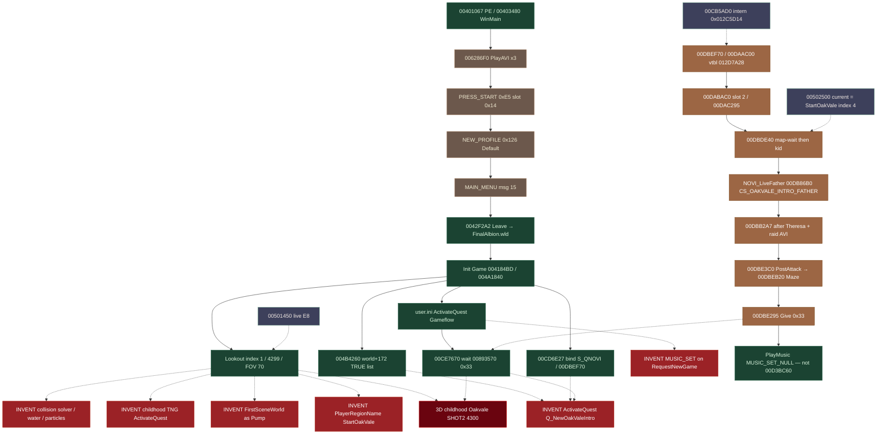

# Playable-path gap graph — Boot → Guild is **not** live

Investigation only. No production `src/` or `tests/` edits.

Do **not** invent `ActivateQuest("Q_NewOakValeIntro")`.
Do **not** write persist `PlayerRegionName` on New Game.
Do **not** start `MUSIC_SET_*` from `RequestNewGame`.
Do **not** queue `ActivateQuest` from childhood TNG.
Do **not** collapse leftover **#4** (Lookout first Present vs
Oakvale intro view).
Do **not** treat `FirstSceneWorld` / `StartNewGame` /
`FIRST_SCENE_*` as `EngineLifecycle.Pump`.
Do **not** declare the milestone reached.

Milestone under audit:

```
Boot → AVI → title → menus → New Game → name
  → 3D childhood Oakvale → raid → Maze
  → immediately before Guild
```

Status words: **PROVEN** / **PARTIAL** / **UNREAD** /
**DISPROVEN** / **LEFTOVER** / **MATCH** / **DIVERGE** /
**WRONG**.

Authority: `docs/PARITY.md`, `docs/status/README.md`,
`docs/runtime/FORWARD_TREE.md`,
`docs/render/FIRST_SCENE_CONTRACT.md`,
`src/Fable.Game/EngineLifecycle.cs` flags,
`RegionTravel.cs`, `NewGameScript.cs`,
`LandscapeTextures.cs`, `Dx9VulkanShaderConstants.cs`;
`EngineLifecycleTests`
`Type1_00CB8220_Gameflow_state0_yields_on_Q_NewOakValeIntro`
/ `No_save_does_not_activate_Q_NewOakValeIntro`
/ `Persist_PlayerRegionName_is_00487C20_not_new_game`
/ `Pe_entry_is_crt_not_new_game`
/ `Load_single_thing_0051FD80_spawns_hero_at_LookoutPoint`;
siblings `oakvale-activate-unread-audit`,
`leftover-4-collapse-audit`,
`oakvale-without-leftover4`,
`00DBDE40-host-gap`,
`00DBDE40-after-activate`,
`00DAAC00-sqnovi-no-save`,
`gameflow-state0-wait`,
`gameflow-type33-give`,
`00893570-give-presenters`,
`q-novi-activator-callers`,
`startoakvale-current-writer`,
`first-region-after-leave`,
`00DBB2A7-attackover-store`,
`audio-musicset-after-leave`.

---

## Direct answers

| Question | Answer | Class |
|---|---|---|
| Does the host implement the playable milestone? | **No.** Live Pump after New Game + name is Lookout adult **4299** / `GuildArrivalHSP` / `006B3FF0` FOV **70**, Gameflow parked on `Q_NewOakValeIntro`. Childhood Oakvale / raid / Maze never run. | **WRONG** vs milestone |
| Is first no-save 3D Present childhood Oakvale? | **No.** LookoutPoint WLD index **1**. | **DISPROVEN** |
| Does Gameflow leave the Oakvale wait on this walk? | **No.** `GameflowWaitsForeverOnNoSave=true`. Wait is type-`0x33` Give, not construct. | **MATCH** dump; **WRONG** vs playable |
| Would inventing `ActivateQuest("Q_NewOakValeIntro")` finish the wait? | **No.** Construct posts **`0x37`**. Wait needs **`0x33`**. `ActivateQuestSatisfiesGameflowWait=false`. | **DISPROVEN** invention |
| Does childhood TNG queue that activate? | **No.** `ChildhoodTngQueuesActivateQuest=false`. `StartOakValeWest.tng` has `XXXSectionStart` only. | **DISPROVEN** invention |
| Is `PlayerRegionName` written on New Game? | **No.** `PlayerRegionNameWrittenOnNewGame=false`. `00487C20` is continue. | **DISPROVEN** invention |
| Does New Game start `MUSIC_SET_*`? | **No.** `RequestNewGameStartsMusicSet=false`. `LastMusic` empty. | **MATCH** skip |
| Do first-seen particles / water / collision-solver run? | **No.** GPU particles skipped; water `00B783F0` empty-out; collision is pose persist + bitset collect. | **MATCH** skip |
| Who `00CB5AD0`s intern `0x012C5D14` on no-save? | **Nobody recovered.** Unique `E8` is `004B42E8` inside `004B4260`; `world+172` omits the name. | **UNREAD** presenter; **PROVEN** omit |
| After a *proven* activate, does the host run `00DBDE40`? | **No.** Generic fiber + `TickNamedQuestMain` yield. | **DIVERGE** |
| Is `FirstSceneWorld` a win? | **No.** Fixture soup. Zero Pump / client callers. Leftover **#4**. | **LEFTOVER** |
| Stop before Guild? | Maze last line `PlayMusic MUSIC_SET_NULL,FALSE`. `MilestoneEntersGuildTake=false`. Do not `00D3BC60`. | **PROVEN** stop |
| May this page declare success? | **No.** | **WRONG** |

---

## Verdict

**The implementation is WRONG versus the playable
milestone.** Matching the recovered **no-save dump walk**
is not matching **Boot → childhood Oakvale → raid → Maze**.

Dump-backed no-save after Leave:

- first *real* region / first *rendered* 3D is **LookoutPoint**
  (index **1**, `RegionThings` + `006B3FF0`, adult **4299**,
  `GuildArrivalHSP`)
- `user.ini` `ActivateQuest("Gameflow")` only
- Gameflow `00CE7670` state 0 **yields forever** on type-`0x33`
  Give of `Q_NewOakValeIntro`
- `S_QNOVI` is **bound** (`00CD6E27` / `00CB5C90`) and **not
  constructed** (`00DAAC00` / `00DABAC0` not entered)
- `00DBDE40` is **not** a Pump callee

Retail playable childhood Oakvale is a **later** fiber after
a **proven** `00CB5AD0("Q_NewOakValeIntro")` **and** a
**proven** current-region write of index **4** `StartOakVale`.
Neither presenter is recovered. Inventing either is
**DISPROVEN**.

`FIRST_SCENE_CONTRACT.md` / `FirstSceneWorld` still name
`StartOakValeWest` / `HerosOldHouse` / `CAM_OVIF_SHOT2` /
kid **4300** as “first-seen New Game”. That is the **intro
view ledger**, not live Pump. Collapsing it onto first
Present is leftover **#4**. PARITY “Player start + walk /
New game is not Lookout / click path `START_NEW_QUEST`”
is **stale** against the dump walk (`004B5080` is save parse,
**0** external `E8` on no-save).

Frontend Boot → AVI → title → menus → New Game → name is
**PARTIAL** with open leftovers **#14 #20 #36 #46 #48**.
It is not a locked path to 3D childhood.

Do **not** invent `ActivateQuest` to “reach Oakvale”.
Construct would still miss Gameflow’s Give wait, still
miss `00DBDE40` on the host, still miss the region write.

---

## Locked flags (dump truth, not a win)

| Flag | Value | What it locks |
|---|---|---|
| `GameflowWaitsForeverOnNoSave` | **true** | `00CE7670` state 0, `vtbl+100` `00893570("Q_NewOakValeIntro")`, no timeout |
| `ActivateQuestSatisfiesGameflowWait` | **false** | Construct `0x37` ≠ Give `0x33`. `00DBE295` is after AttackOver **and** PostAttack **and** Maze |
| `PlayerRegionNameWrittenOnNewGame` | **false** | `00487C20` / `00449E60` continue; HEADER is `CurrentRegionName`; save write `00449F90` only |
| `RequestNewGameStartsMusicSet` | **false** | No `00CC8EAC` / `MUSIC_SET_*` on Leave / New Game. Intro `PlayMusic` is later leftover |
| `ChildhoodTngQueuesActivateQuest` | **false** | No `CActivateQuestDef` / `CTCActionUseActivateQuest`. Oakvale name in TNG is `XXXSectionStart` |
| `FirstSeenCanRenderParticles` | **false** | GPU submit skip. Oakvale authors 47 `PARTICLE_EMITTER_PLACEABLE`. Register `CParticleAttacherDef` is Note-only |
| `LandscapeTextures.FirstSeenWaterDrawShouldSubmit` | **false** | `00B783F0` empty-out `00B7A865` bare `ret 4`. No 7363 mesh. Second gate unreached |
| `EngineLifecycle.FirstSeenCollisionIsSolver` | **false** | First-seen is pose persist + `0048D400` bitset collect. Do not invent a solver |
| `Dx9VulkanShaderConstants.FirstSeenPaletteIsBindPose` | **true** | Kid **4300** dest ≈ identity. `FirstSeenPlayAnimationAppliesPose=false` |
| `RegionTravel.StartOakValeSetupLoadsRegion` | **false** | `00DBDE40` **waits** `vtbl+48("StartOakVale")`. Does not `00500540` |
| `RegionTravel.FirstSeenAttackOverStoreRuns` | **false** | Store is `00DBB2A7` after Theresa CS + raid AVI |
| `RegionTravel.RaidAviIsBanditRaid` | **false** | AVI is `1_raid_on_oak_vale_comp.xmv`, not `CS_BANDITRAID_*` |
| `NewGameScript.GiveAfterPostAttackAndMaze` | **true** | Give `00DBE295` after `00DBE3C0` **and** `00DBEB20` |
| `RegionTravel.MilestoneEntersGuildTake` | **false** | Stop at Maze last `PlayMusic MUSIC_SET_NULL,FALSE`. Do not `00D3BC60` |
| `PumpCallsLoadFromFirstRealRegion` | **false** | `00501450` named inbound **0**. Live native entry **UNREAD** |

---

## Milestone vs live host (ruthless)

```
MILESTONE                         LIVE HOST (no-save Pump)
─────────────────────────────     ────────────────────────────────────────
Boot PE 00401067                  MATCH 00401067 / WinMain 00403480
AVI ×3 006286F0                   PARTIAL leftover #20 (3D Draw during PlayAVI)
title PRESS_START 0xE5            PARTIAL dest invented 512,384,512,384 (#36)
menus 0x126 then 15               PARTIAL #14 #46 #48; Present 0042DF9E Note
New Game Leave 0042F2A2           MATCH message; click dest not locked
name 00851770 "Default"           PARTIAL New Profile dest/hit host (#48)
3D childhood Oakvale              WRONG — Lookout adult 4299 FOV 70
raid 1_raid_on_oak_vale_comp      NEVER — S_QNOVI not constructed
Maze CS_OAKVALEINTRO_HESDEADJIM   NEVER
immediately before Guild          NEVER — Gameflow parked; no Give 0x33
```

North star in `docs/status/README.md` is still
`StartOakValeWest` / `Q_NewOakValeIntro` / `HerosOldHouse` /
`CAM_OVIF_SHOT2` so `CS_OAKVALE_INTRO_FATHER` can run on a
real world clock. Master is proving **boot / world clock**,
not that fiber. Freeze text: New Game still not locked
(Enter is PlayAVI skip). leave #14 and #20 open.

---

## Dependency graph

Class key:

- **MATCH** — dump body recovered; host follows it (or
  honestly skips)
- **LEFTOVER** — host stand-in / Note-only / fixture / open
  issue. Not a native lock
- **DISPROVEN invention** — a plug that the dump already
  forbids
- **UNREAD** — on the native chain; presenter / body not
  recovered. Do not guess
- **DIVERGE** — dump recovered; host would still miss even
  if the unread presenter existed
- **WRONG** — live result vs the playable milestone



Solid arrows = recovered order. Dashed = blocked, invented,
or ledger-only. Gameflow’s wait returns only after **Give**
(`00DBE295`), which is **after Maze**. Inventing construct
does not take that dashed edge.

---

## Node census

### MATCH (dump recovered; host follows or honestly skips)

| Node | Native | Host |
|---|---|---|
| Boot | `00401067` CRT → `00403480` WinMain → `00402510` | `Pe_entry_is_crt_not_new_game` |
| Leave | `0059A238` msg **15** → `[retail+41]=1` → `0042F2A2` → `FinalAlbion.wld` | message path PROVEN; dest leftover |
| WLD / Init | `00507C30` / `004A1840` after Startup WAD | MATCH |
| Init Quests | `004B4260([world+172])` nine TRUE names, **no** Oakvale | `WorldPlus172` omit |
| Bind | `00CD6E27` `00CB5C90` `Q_NewOakValeIntro` / `S_QNOVI` / `00DBEF70` persist 0 | Note “bind not 00CB5AD0” |
| user.ini | `00419CE0` → vtbl+1104 `00892E80` → `004B4A10("Gameflow")` | MATCH |
| Gameflow wait | `00CE7670` `00893570` kind **`0x33`** name compare | yield; `GameflowYieldQuest` set |
| Construct event | `004B3CE0` posts **`0x37`** / 55 | `EventPosts=10` all construct |
| First 3D | Lookout index **1**, `GuildArrivalHSP`, adult **4299**, `006B3FF0` FOV **70** | leftover **#4** pairing, live Present |
| Music skip | no `MUSIC_SET_*` on RequestNewGame | `LastMusic` empty |
| Particles skip | `FirstSeenCanRenderParticles=false` | GPU not submitted |
| Water skip | `00B783F0` empty-out | `FirstSeenWaterDrawShouldSubmit=false` |
| Collision | pose persist + collect bit `0x64`; not a solver | `FirstSeenCollisionIsSolver=false` |
| Kid palette | bind-pose identity; no play-anim | `FirstSeenPaletteIsBindPose=true` |
| Guild stop | Maze last `PlayMusic MUSIC_SET_NULL,FALSE` | `MilestoneEntersGuildTake=false` |

### LEFTOVER (open; not a native lock; not success)

| Node | Why leftover | Issue / flag |
|---|---|---|
| Startup PlayAVI | Unload recovered; **3D Draw during AVI** | **#20** |
| dest 512,384,512,384 | invented; tests lock the invention; DIP `(0,0)` stand-in | **#36** |
| New Game keyboard N/Enter | Enter is PlayAVI skip; `ClickNamed` dest invented | **#14** |
| Present `0042DF9E` | Note-only; host skips world/gizmos on `_frontendReady` | status freeze |
| Type-18 skip vtbl+400 (+504) | CRC parsed, **not applied**; inactive forest tiles present | **#46** |
| New Profile dest/hit | `TryChromeHit` invents type-16/37 hit | **#48** |
| First-proximity TNG | host `break` on first proximity map; OOM workaround | **#50** |
| `00501450` | body PROVEN; Pump never calls; named inbound **0** | UNREAD live entry |
| Add Def Class | Note + `*DefClassRegistered`; not live objects | Thing Components |
| `FirstSceneWorld` / `StartNewGame` | Oakvale soup; **zero** Pump / client callers | leftover **#4** |
| Overlay / interface | `00435000` / `00435070` Note | PARTIAL |
| `PlayAnimation` runtime | apply PROVEN; pose `00AA0090` unread | `FirstSeenPlayAnimationAppliesPose=false` |
| Script Create/Remove mesh | `008A9100` / `004C9B80` UNREAD | PARITY 0b |
| `IBasicAudio` | native `00A3B9D0` QIs; host does not | **#9** |

### DISPROVEN invention risk (do not plug)

| Invention | Why it fails | Flag / proof |
|---|---|---|
| `ActivateQuest("Q_NewOakValeIntro")` on no-save | No recovered presenter. Construct is **`0x37`**, wait needs **`0x33`**. Host `ActivateQuest` still would not run `00DBDE40`. | `ActivateQuestSatisfiesGameflowWait=false`; `oakvale-activate-unread-audit`; `00DBDE40-host-gap` |
| Treat Gameflow wait-success as Guild | After Give, still `SharedRun+4=0` / `OV_INTRO`. Guild is `+4==0x64`. `==1` is jump-table **ret**. | `gameflow-state0-wait` |
| `PlayerRegionName=StartOakVale` on New Game | Continue-only. Zero no-save writer. | `PlayerRegionNameWrittenOnNewGame=false` |
| Replace `00501450(1)` with Oakvale | leftover **#4** collapse. First Present is Lookout. | `leftover-4-collapse-audit` |
| Childhood TNG `CActivateQuestDef` | Payloads are NULLDEF / chest / guild-teleport / time-display. No intern `0x012C5D14`. TNG is `XXXSectionStart`. | `ChildhoodTngQueuesActivateQuest=false` |
| `script.bin` intern | **0** hits of `0x012C5D14` | `oakvale-activate-unread-audit` |
| `EXPRESSION+120` / `007EF200` | persist ≠ Oakvale; tick does not store intern | `ExpressionPlus120IsOakvaleIntern=false` |
| `user.ini` Oakvale | file is `"Gameflow"` | `ini-activate-quest` |
| `004B5080` `START_NEW_QUEST` | save parse; **0** external `E8` no-save | PARITY “Who activates” |
| `AddTestQuest` activates | `004A113B` stores `world+196` only | same |
| `00CD6E27` as construct | factory bind `00CB5C90`, not `00CB5AD0` | `00DAAC00-sqnovi-no-save` |
| `RequestNewGame` `MUSIC_SET_*` | no `00CC8EAC` on this tree | `RequestNewGameStartsMusicSet=false` |
| Particle GPU / water 7363 / Unity solver | first-seen skips | flags above |
| `SeedAt(1.6m)` / SHOT2 FOV 72 as Lookout | `006B2CA0` pose PROVEN; Lookout FOV **70** | do not reopen #6 / #13 |
| `FirstSceneWorld.Build` from Pump | fixture; leftover **#4** | `leftover-4-collapse-audit` CLEAN split |
| `00DB8680` starts father CS | dtor. Start is `00DB86B0` | PARITY Did not work |
| Raid AVI = adult `CS_BANDITRAID_*` | different asset | `RaidAviIsBanditRaid=false` |
| Invent `AttackOver=1` at bind | store is `00DBB2A7` after raid | `FirstSeenAttackOverStoreRuns=false` |
| Enter Guild take after Maze | `00D3BC60` off milestone | `MilestoneEntersGuildTake=false` |

### UNREAD (blockers — recover, do not invent)

| Gap | What dump already says | What is missing |
|---|---|---|
| Oakvale **construct presenter** | Unique `00CB5AD0` `E8` = `004B42E8` in `004B4260`. Every no-save list **excludes** intern `0x012C5D14`. Later callers copy a CString (`[comp+40]`, `[this+168]`, picker). | First live Thing / copied name that **is** `Q_NewOakValeIntro` **after a region exists**. Off no-save Type-1 (`CurrentRegion=null`) |
| Oakvale **region writer** | `00DBDE40` waits `vtbl+48("StartOakVale")`. `00502500` LoadRegionAtMap machinery PROVEN. `00487C20` continue-only. | Oakvale-specific `00502500` / `00500540(4,…)` caller |
| `00501450` inbound | Body: `004FEEC0` then `00500540(i,0,0)` i=1..141. **0** E8/E9/imm/vtbl | Live native entry. Host `LoadFromFirstRealRegion` is a test stand-in |
| `[NewRegion record+36]` first non-null writer | Null is native no-save | UNREAD |
| Consumed first-Present helper | ctor packer / `00988A50` WVP locked | helper actually consumed UNREAD |
| `004978A0` LCG | spring ran; Weight0/V0 locked | seed unread |
| PALSKIN type1/Flag1 routing | geometry still `0x100` | leftover research, not a new issue |

### DIVERGE (even after a proven activate the host still misses)

From `proofs/00DBDE40-host-gap`:

| Host | Native after `00CB5AD0` |
|---|---|
| `QuestFactoryTable.Recovered` 8 rows, no Oakvale | 161-row fill includes `00CD6E27` |
| `ScriptRuntime.ActivateQuest` generic fiber | `00DBEF70` / `00DAAC00` / slot 2 `00DABAC0` |
| `TickNamedQuestMain` else-arm Notes `00CB7950` + yield | `00A44880` → `00DABAC0` → `00DBDE40` |
| `ResumeGameflowWait` always Notes miss `0` | `00893570` would read live Give |
| `PumpGame` no `Runtime.Update` | fiber slot 2 |
| `LoadFromFirstRealRegion` Lookout 1 | map-wait wants index **4** |

Constants / bind Notes already **MATCH**. Runnable fiber does
**not**. Do not grow `Pump` to jump `00DBDE40`.

---

## Dual ledger (leftover **#4** — keep open)

| Ledger | Map / spawn | Camera | Hero | When |
|---|---|---|---|---|
| **No-save first Present** | LookoutPoint index **1**, `GuildArrivalHSP` | `006B3FF0` FOV **70** | `CREATURE_HERO` **4299** | after Leave, first 3D |
| **Intro view** (later) | `StartOakValeWest`, region index **4**, `HerosOldHouse` | `CAM_OVIF_SHOT2` FOV **72** | `CREATURE_HERO_CHILD` **4300** | after proven activate + map-wait + `CS_OAKVALE_INTRO_FATHER` |

Do **not** collapse. Do **not** fold **#50** into **#4**.

---

## Minimum recovered native chain still missing to **Oakvale intro**

Stop at the first unproven item. **Do not invent
`ActivateQuest`.** Intro here means 3D childhood
`StartOakValeWest` / `HerosOldHouse` / `CAM_OVIF_SHOT2` /
kid **4300** / `CS_OAKVALE_INTRO_FATHER` **after** Lookout
first Present — not a replacement of it.

### Blockers (no dump site → no host call)

1. **Proven construct presenter of intern `0x012C5D14`.**
   Must be a dump `E8` / vtbl into `004B4260` / `004B4A10` /
   `00CB5AD0` whose **copied CString** is `Q_NewOakValeIntro`.
   Recovered no-save lists omit it. `00CD6E27` is bind.
   `world+172` is Sunnyvale…. `user.ini` is Gameflow.
   Childhood TNG does not queue it. **UNREAD.**
2. **Proven current-region write of index 4 `StartOakVale`.**
   `00DBDE40` only **queries** `vtbl+48`. `00502500` is the
   later switch. `PlayerRegionName` is continue.
   `StartOakValeSetupLoadsRegion=false`. **UNREAD caller.**

Until (1) and (2) are dump sites, the host **must not**
call `ActivateNamedQuest("Q_NewOakValeIntro")` or
`RequestLoadRegion("StartOakVale")` from Pump.

### After those sites exist — host still DIVERGE (recover, then wire)

3. **`QuestFactoryTable` row** — `Q_NewOakValeIntro` /
   `S_QNOVI` / factory `00DBEF70` / run `00DABAC0` /
   persist **0**. `Find` currently misses.
4. **Construct** — `00DBEF70` alloc `0x10C` ctor `00DAAC00`
   vtbl `012D7A28`. `00CB7900` vtbl+12 then vtbl+4.
   Slot 1 Main watcher `00CDD450` / `00CDD440`.
5. **Persist bind only** — `00DAADA0` `004045C0("AttackOver",
   this+80)`. Do **not** store `+80=1` (`00DBB2A7` is later).
6. **Fiber slot 2** — `00A447D0` then `00A44880` /
   `00A446A0` `[vtbl+8]=00DABAC0`. Zero `.text` `E8` of
   `00DABAC0`. `TickNamedQuestMain` else-arm is **not** this.
7. **`00DABAC0` name table** — `00CB8230` `NOVI_*` (including
   `NOVI_LiveFather` factory `00DAC2C0`) **before** map-wait.
   Then **only** `E8` `00DAC295` → `00DBDE40`.
8. **`00DBDE40` wait order** — map-wait `"StartOakVale"` →
   `00CB7940` abort → READ `[this+80]` (false) →
   `CREATURE_HERO_CHILD` → three watchers (`00DBE890` /
   `00DBE2E0` / `00DBE4E0`) → `Q_NewOakValeIntro_PreAttack`
   → `vtbl+2584(12.0)` → `HerosOldHouse` → **SPIN** `+80`.
9. **Father CS** — TNG `CREATURE_HERO_FATHER` /
   `NOVI_LiveFather` construct `00DAC2C0` → persist
   `00DB8630` `[+52].vtbl+4` = **`00DB86B0`** →
   `00CBFB7D("CS_OAKVALE_INTRO_FATHER")` →
   `UseCamera CAM_OVIF_SHOT2` `00CC9F3A` / `00B23B50` FOV **72**.
   `Hero.Teleport MK_OVI_ID_HERO` is **same-region**
   (`FirstSeenTeleportChangesRegion=false`).

Script-layer `CS_OAKVALE_INTRO_FATHER` def+60 is **Finished**.
Apply/runtime leftovers (pose, Create mesh, Speak UI, SneakTo
move) stay **PARTIAL**. They are **not** the activator.

That is the **minimum** chain to **Oakvale intro**. Raid /
Maze / Give are **after** intro and are **not** required to
draw SHOT2. They **are** required for the rest of the
milestone and for Gameflow to leave the wait.

---

## After intro (milestone tail — still missing, still no invention)

Do not run this from Pump. Do not treat Give as construct.

```
00DBDE40 SPIN +80
  CS_OAKVALE_INTRO_THERESA_MEET  00DB97A0
  CS_OAKVALE_INTRO_THERESA       00DBB238  00CBFB7D
  PlayAVI 1_raid_on_oak_vale_comp.xmv     vtbl+1476 00DBB260
  00DBB2A7  mov [quest+80], 1             AttackOver
00DBE3C0  Q__OakValeIntro_PostAttack      vtbl+1104 construct OTHER name
00DBEB20  CS_OAKVALEINTRO_HESDEADJIM      last: PlayMusic MUSIC_SET_NULL,FALSE
00DBE295  vtbl+2620 00891880 then vtbl+1152 Give 0x33 of ticking slot
00CE7670  00893570 now 1                  still OV_INTRO; fresco; NOT Guild
          do not 00D3BC60 Guild take
```

`GiveAfterPostAttackAndMaze=true` is a **VA order lock**,
not a live host walk. On no-save Type-1, `00893570` stays
**0** forever.

---

## What would look like success and is **not**

| Fake win | Why it is not the milestone |
|---|---|
| Lookout Present with adult 4299 | MATCH dump first 3D. **WRONG** vs childhood Oakvale |
| `FirstSceneWorld` screenshot of SHOT2 | Fixture, not Pump. leftover **#4** |
| `ActivatedQuests` contains `Q_NewOakValeIntro` because a test called `ActivateQuest` | Invented presenter; still miss Give `0x33`; still miss `00DBDE40` |
| Gameflow `GameflowState!=0` | Guild is `+4==0x64`, not `1`. Wait-success stays `OV_INTRO` |
| `PlayerRegionName="StartOakVale"` seeded in host ctor | Continue path. `PlayerRegionNameWrittenOnNewGame=false` |
| Frontend dest tests passing 512,384,512,384 | Tests lock the **invention**. #36 open |
| Hover tautology `HoverSelectFn==0x0055BF10` | Named constant, not dest lock |
| Add Def Class `*DefClassRegistered=true` | Note-only, not a live object |
| Coverage 13 PROVEN runtimes | Fade/AVI/WaitFlag…. Not Oakvale intro |

---

## Open issues that still sit on this path

Leave open. Do not close from this proof.

| # | Why it still blocks a playable claim |
|---|---|
| **#4** | Lookout first Present vs Oakvale intro view. Ledger pairing. |
| **#14** | New Game keyboard / Enter = PlayAVI skip. Click dest invented. |
| **#20** | PlayAVI still 3D Draw. |
| **#36** | dest invented; DIP `(0,0)` stand-in. |
| **#42** | dest `0044C72B` as `[01232C24+8]` not rdata-locked. |
| **#46** | native skip vtbl+400 unused. |
| **#48** | New Profile dest/hit host stand-in. |
| **#50** | first-proximity TNG OOM workaround. |

Also leftover: `#9` `IBasicAudio`. Do not reopen `#6` / `#13`.

---

## Do not

- Invent `ActivateQuest("Q_NewOakValeIntro")`.
- Invent `PlayerRegionName` / index-4 load on New Game.
- Invent childhood TNG `ActivateQuest`.
- Invent `MUSIC_SET_*` on `RequestNewGame`.
- Collapse leftover **#4**.
- Call `FirstSceneWorld.Build` from Pump.
- Jump `00DBDE40` from `Pump` / `TickWorld`.
- Treat construct `0x37` as Give `0x33`.
- Treat Gameflow wait-success as Guild.
- File particles / water / solver as first-seen GPU work.
- Declare Boot → Guild success.

The next honest recover is a **dump presenter** of intern
`0x012C5D14` into `004B4260` that is **not** on the no-save
Type-1 walk, **or** a **dump caller** of `00502500` that
writes current region **4** after Lookout first Present.
Until that listing line exists, the playable path is
**WRONG** and the host must stay parked.
